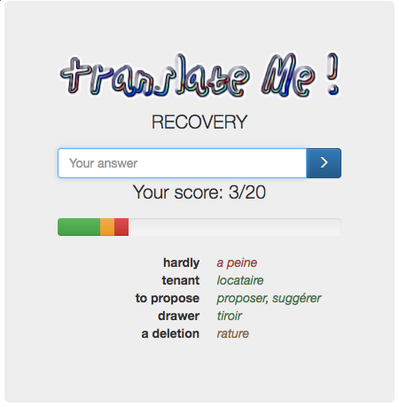

<h2>Table of Contents</h2>

<ul>
<li><a href="#sec-1">1. Practice your English `vocabulaire`!</a></li>
<li><a href="#sec-2">2. How to play the game?</a></li>
<li><a href="#sec-3">3. Preview</a></li>
</ul>

# Practice your English \`vocabulaire\`!

A family member recently asked me if I could build her some software to practice english vocabulary. The application would rely on a CSV list of english to french translations to ask the player a french translation of a random expression.

I found this a good opportunity to have another go at Elm, especially since the latest 0.18 release. I'm happy to say it was again a fun experience!

The game can be played [here](http://s3.amazonaws.com/translateme/index.html).

# How to play the game?

-   **Mandatory step:** Learn French :frowning: :wine:
-   Click on the link mentioned above;
-   Answer the 20 random translations;
-   Repeat.

# Preview

